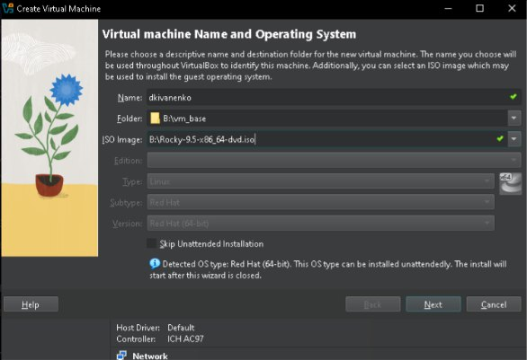
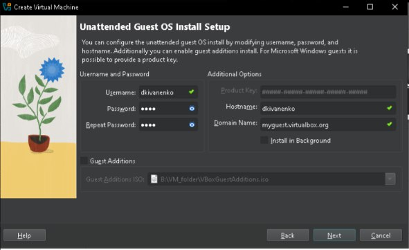
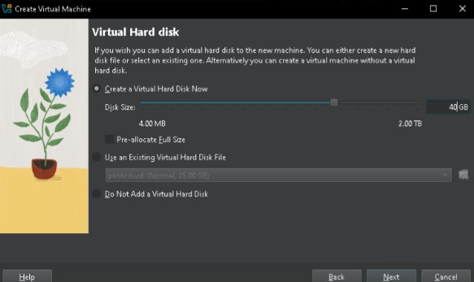
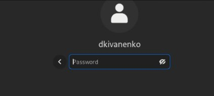
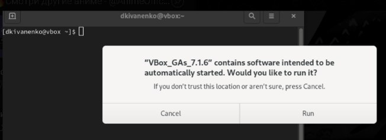
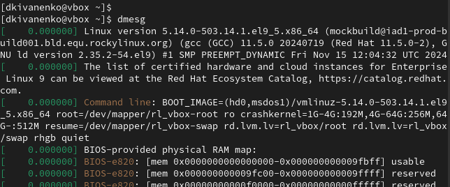
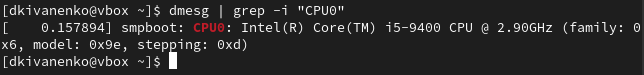
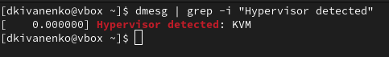
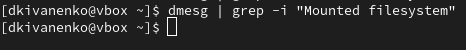
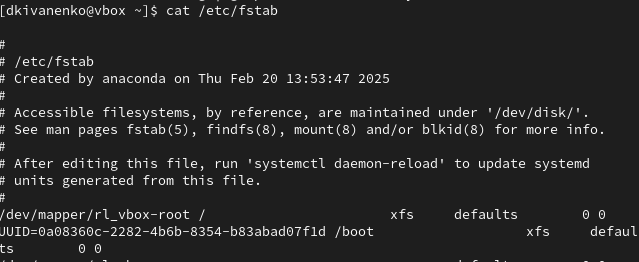

---
## Front matter
lang: ru-RU
title: "Презентация по лабораторной работе №1"
subtitle: 'Предмет: Основы информационной безопасности'
author:
  - Иваненко Д.К.
institute:
  - Российский университет дружбы народов, Москва, Россия
date: 2/20/2025

## i18n babel
babel-lang: russian
babel-otherlangs: english

## Formatting pdf
toc: false
toc-title: Содержание
slide_level: 2
aspectratio: 169
section-titles: true
theme: metropolis
header-includes:
 - \metroset{progressbar=frametitle,sectionpage=progressbar,numbering=fraction}
---

# Цели и задачи
Целью этой работы является приобретение практических навыков установки операционной 
системы на виртуальную машину, настройки минимально необходимых для дальнейшей работы
сервисов.

# Выполнение лабораторной работы

Предварительно установив iso файл с официального сайта дистрибьютива rocky, открываю 
VM manager от Virtual Box и нажимаю на создание новой виртуальной машины.
Ввожу по принципу именования имя машины, выбираю файл, где будут храниться ее файлы,
и, наконец, выбираю iso образ:

{#fig:001 width=70%}

Нажимаю далее, и ввожу логин и пароль пользователя:

{#fig:001 width=70%}

Выделяю оперативную память и кол-во ядер процессора:

{#fig:001 width=70%}

Затем создаю виртуальный жеский диск на 40 ГБ:

{#fig:001 width=70%}

Запускается машина, я выбираю язык:

{#fig:001 width=70%}

Потом необходимо ввести логин и пароль уже пользователя системы, нажимаю готово и начинается процесс установки:

{#fig:001 width=70%}

После него, система прогрузилась, ввожу логин и пароль:

{#fig:001 width=70%}

Устанавливаю доп. гостевые additions: 

{#fig:001 width=70%}

# Выполнение заданий

Ввожу команду dmesg:

{#fig:001 width=70%}

Теперь узнаю версию линукса:

{#fig:001 width=70%}

Дальше идет частота процессора:

{#fig:001 width=70%}

Затем идет сам процессор, тут кстати, выводится частота:

{#fig:001 width=70%}

Теперь доступная ОЗУ:

{#fig:001 width=70%}

Hypervisor:

{#fig:001 width=70%}

Mouned filesystem:

{#fig:001 width=70%}

Используем cat и просматриваем fstab:

{#fig:001 width=70%}

# Выводы

Приобрели навыки установки операционной системы на виртуальную машину, а также настрройки минимально необходимых для работы сервисов.

:::

