---
## Front matter
title: "Отчет по лабораторной работе №1"
subtitle: "Предмет: Основы информационной безопасности"
author: "Иваненко Дмитрий Кириллович"

## Generic otions
lang: ru-RU
toc-title: "Содержание"

## Bibliography
bibliography: bib/cite.bib
csl: pandoc/csl/gost-r-7-0-5-2008-numeric.csl

## Pdf output format
toc: true # Table of contents
toc-depth: 2
lof: true # List of figures
lot: true # List of tables
fontsize: 12pt
linestretch: 1.5
papersize: a4
documentclass: scrreprt
## I18n polyglossia
polyglossia-lang:
  name: russian
  options:
	- spelling=modern
	- babelshorthands=true
polyglossia-otherlangs:
  name: english
## I18n babel
babel-lang: russian
babel-otherlangs: english
## Fonts
mainfont: IBM Plex Serif
romanfont: IBM Plex Serif
sansfont: IBM Plex Sans
monofont: IBM Plex Mono
mathfont: STIX Two Math
mainfontoptions: Ligatures=Common,Ligatures=TeX,Scale=0.94
romanfontoptions: Ligatures=Common,Ligatures=TeX,Scale=0.94
sansfontoptions: Ligatures=Common,Ligatures=TeX,Scale=MatchLowercase,Scale=0.94
monofontoptions: Scale=MatchLowercase,Scale=0.94,FakeStretch=0.9
mathfontoptions:
## Biblatex
biblatex: true
biblio-style: "gost-numeric"
biblatexoptions:
  - parentracker=true
  - backend=biber
  - hyperref=auto
  - language=auto
  - autolang=other*
  - citestyle=gost-numeric
## Pandoc-crossref LaTeX customization
figureTitle: "Рис."
tableTitle: "Таблица"
listingTЦitle: "Листинг"
lofTitle: "Список иллюстраций"
lotTitle: "Список таблиц"
lolTitle: "Листинги"
## Misc options
indent: true
header-includes:
  - \usepackage{indentfirst}
  - \usepackage{float} # keep figures where there are in the text
  - \floatplacement{figure}{H} # keep figures where there are in the text
---

# Цель работы

Целью этой работы является приобретение практических навыков установки операционной 
системы на виртуальную машину, настройки минимально необходимых для дальнейшей работы
сервисов.

# Выполнение лабораторной работы

Предварительно установив iso файл с официального сайта дистрибьютива rocky, открываю 
VM manager от Virtual Box и нажимаю на создание новой виртуальной машины.
Ввожу по принципу именования имя машины, выбираю файл, где будут храниться ее файлы,
и, наконец, выбираю iso образ:

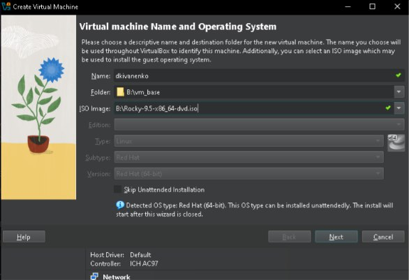{#fig:001 width=70%}

Нажимаю далее, и ввожу логин и пароль пользователя:

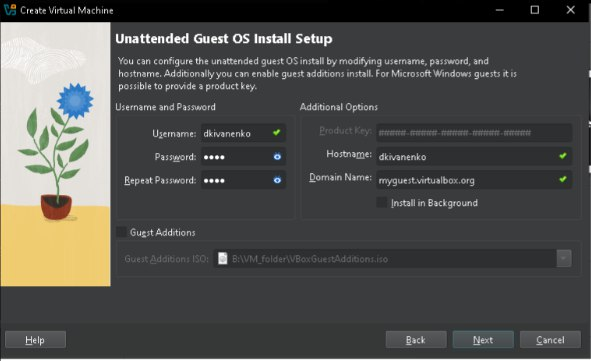{#fig:001 width=70%}

Выделяю оперативную память и кол-во ядер процессора:

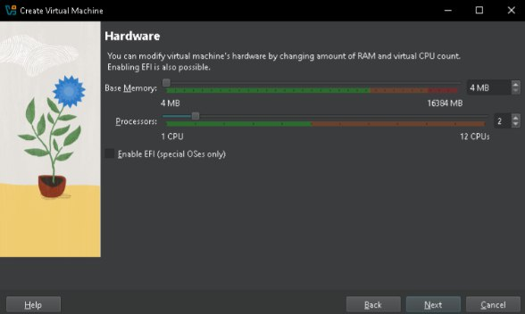{#fig:001 width=70%}

Затем создаю виртуальный жеский диск на 40 ГБ:

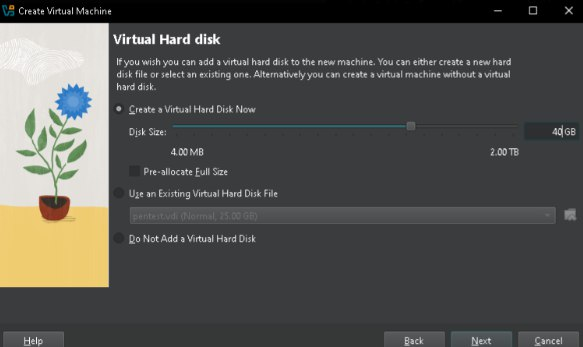{#fig:001 width=70%}

Запускается машина, я выбираю язык:

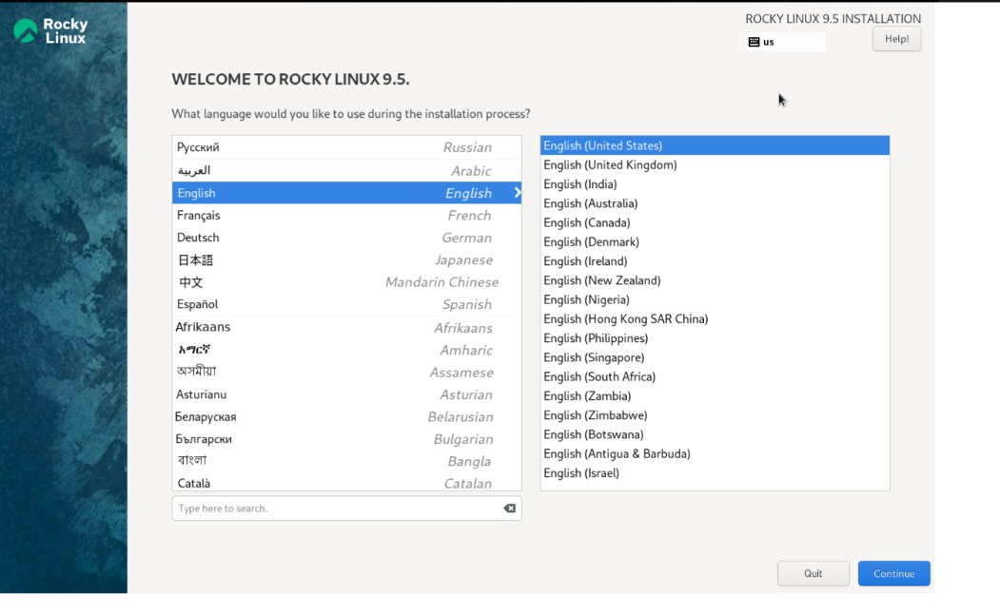{#fig:001 width=70%}

Потом необходимо ввести логин и пароль уже пользователя системы, нажимаю готово и начинается процесс установки:

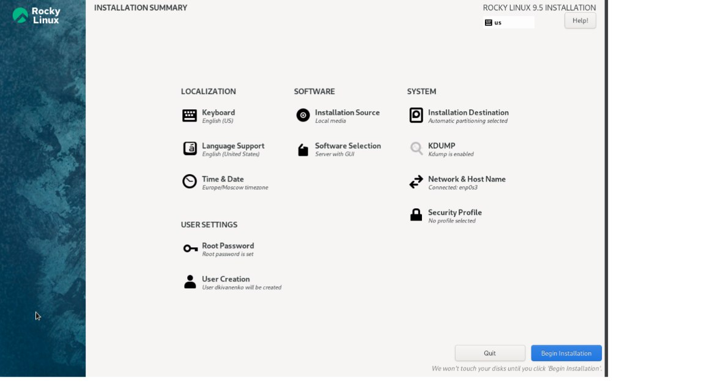{#fig:001 width=70%}

После него, система прогрузилась, ввожу логин и пароль:

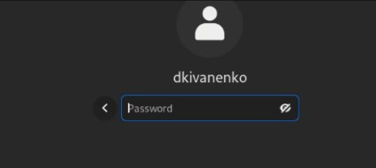{#fig:001 width=70%}

Устанавливаю доп. гостевые additions: 

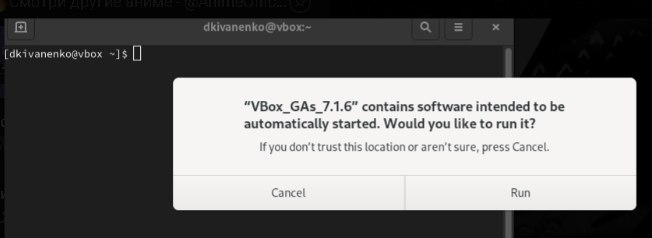{#fig:001 width=70%}

# Выполнение заданий

Ввожу команду dmesg:

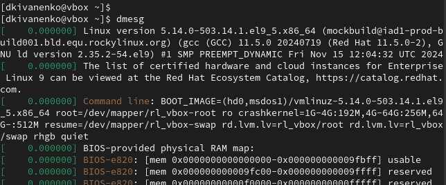{#fig:001 width=70%}

Теперь узнаю версию линукса:

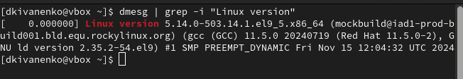{#fig:001 width=70%}

Дальше идет частота процессора:

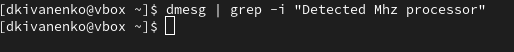{#fig:001 width=70%}

Затем идет сам процессор, тут кстати, выводится частота:

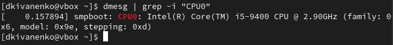{#fig:001 width=70%}

Теперь доступная ОЗУ:

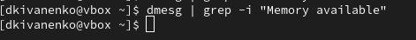{#fig:001 width=70%}

Hypervisor:

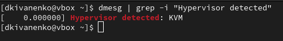{#fig:001 width=70%}

Mouned filesystem:

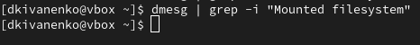{#fig:001 width=70%}

Используем cat и просматриваем fstab:

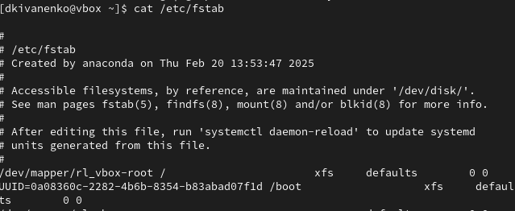{#fig:001 width=70%}

# Выводы

Приобрели навыки установки операционной системы на виртуальную машину, а также настрройки минимально необходимых для работы сервисов.

# Список литературы{.unnumbered}

::: {#refs}
:::
